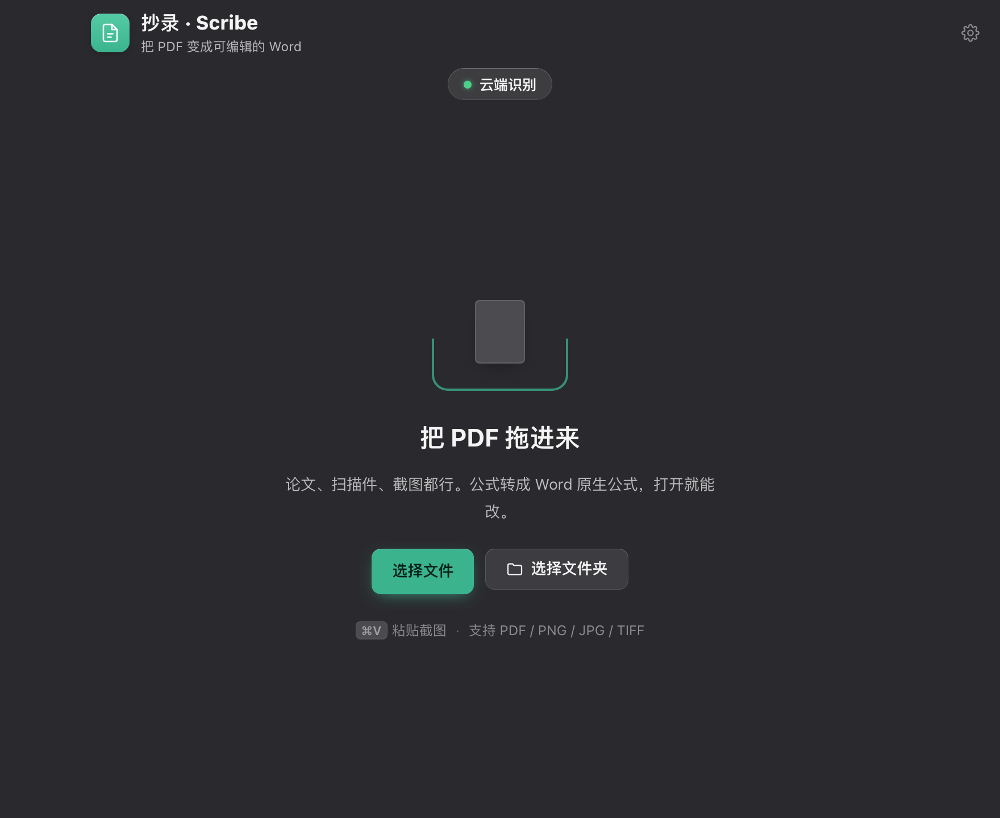

# 抄录 · Scribe

PDF / 图片 → 可编辑 Word。公式转成 Word 原生公式（OMML），双击即可修改。

> Turn PDFs and images into editable Word documents with native equations (OMML).
> macOS desktop app with Chinese / English UI. Local or cloud recognition.

<p align="center">
  
  
</p>
<p align="center">
  
  
</p>

## 功能

- **公式 → Word 原生公式。** 分式、上下标、根号都是可编辑的数学对象。中文下标（如 $c_{\text{水}}$）保持正体。
- **版面还原。** 双栏阅读顺序、跨栏段落接回、表格行列、插图位置。
- **复核报告。** 无法自动确认的内容进一份 HTML 报告：左边原件截图，右边渲染好的公式，直接对照。
- **Word / Markdown 两种导出。** Markdown 模式保留 LaTeX 公式原文。
- **中英文界面。**

## 识别路径

程序自动判断每份文件走哪条路径：

| 输入类型 | 路径 | 速度 |
|---|---|---|
| 数字排版、无公式 | 直接抽文字层 | 3 页 **0.2 秒** |
| 数字排版、有公式 | 混合路径：涂白纯文字行，只让模型认公式 | 9 页 **337 秒** |
| 扫描件 / 矢量公式 | 整页识别 | 约 20–90 秒/页 |

## 本机 / 云端

安装包不含模型权重。装完在设置里选一种：

- **本机识别** — 下载 2.2 GB 模型（默认走 ModelScope），文件不离开本机，无额度限制。
- **云端识别** — 填 [mineru.net](https://mineru.net/apiManage/token) 的 API Key，不下模型、不占本地算力，速度快一个数量级。文件会上传到 mineru.net 服务器，每天 1000 页额度，Key 有效期 90 天。超过 200 页的文件自动分段上传。

## 安装

到 [Releases](../../releases) 下载安装包：

- **macOS** — `.dmg`（Apple Silicon），拖进「应用程序」
- **Windows** — `.exe` 安装程序

macOS 版未签名，首次打开会被 Gatekeeper 拦。右键图标选「打开」，或执行：

```bash
xattr -dr com.apple.quarantine /Applications/抄录.app
```

## 从源码运行

```bash
# 识别引擎（独立 venv，自带 torch）
uv venv .venv-mineru && VIRTUAL_ENV=.venv-mineru uv pip install "mineru[core]"

# 主环境
pip install python-docx lxml beautifulsoup4 Pillow fastapi uvicorn pypdf pymupdf

# pandoc（公式 LaTeX → OMML）
brew install pandoc      # macOS
# Windows: https://pandoc.org/installing.html

# 桌面应用
./run-dev.sh
```

CLI（无 GUI）：

```bash
PYTHONPATH=src python3 -m p2w.cli input.pdf folder/ -o output_dir
PYTHONPATH=src python3 -m p2w.cli paper.pdf --api-token <key>   # cloud
```

测试：

```bash
./tests/run_all.sh          # full (includes a real conversion)
./tests/run_all.sh --fast   # skip real conversion
```

## 架构

```
src/p2w/            Core conversion library (pure Python, no GUI dependency)
  textlayer.py        Text-layer fast path + routing logic
  hybrid.py           Hybrid path: white-out text → sparse PDF → reassemble
  mineru_backend.py   Local engine (subprocess calling MinerU CLI)
  mineru_cloud.py     Cloud API (v4 batch upload, auto-chunking)
  parse_mineru.py     content_list.json → DocModel
  render_docx.py      DocModel → .docx (formulas via pandoc → OMML)
  render_md.py        DocModel → .md (formulas as LaTeX)

src/p2w_gui/        FastAPI backend + React frontend
src-tauri/          Tauri shell (Rust): launches the Python backend as a child process
```

`DocModel` 解耦解析与渲染：换识别引擎或换输出格式，只改一边。

## 依赖与许可

核心识别来自 [MinerU](https://github.com/opendatalab/MinerU)（AGPL-3.0），通过子进程调用。安装包内含 MinerU，分发时需遵守 AGPL-3.0。

其他主要依赖：[PyMuPDF](https://github.com/pymupdf/PyMuPDF)（AGPL-3.0）、
[pandoc](https://pandoc.org)（GPL-2.0+）、[python-docx](https://github.com/python-openxml/python-docx)（MIT）、
[Tauri](https://tauri.app)（MIT/Apache-2.0）、[React](https://react.dev)（MIT）。
