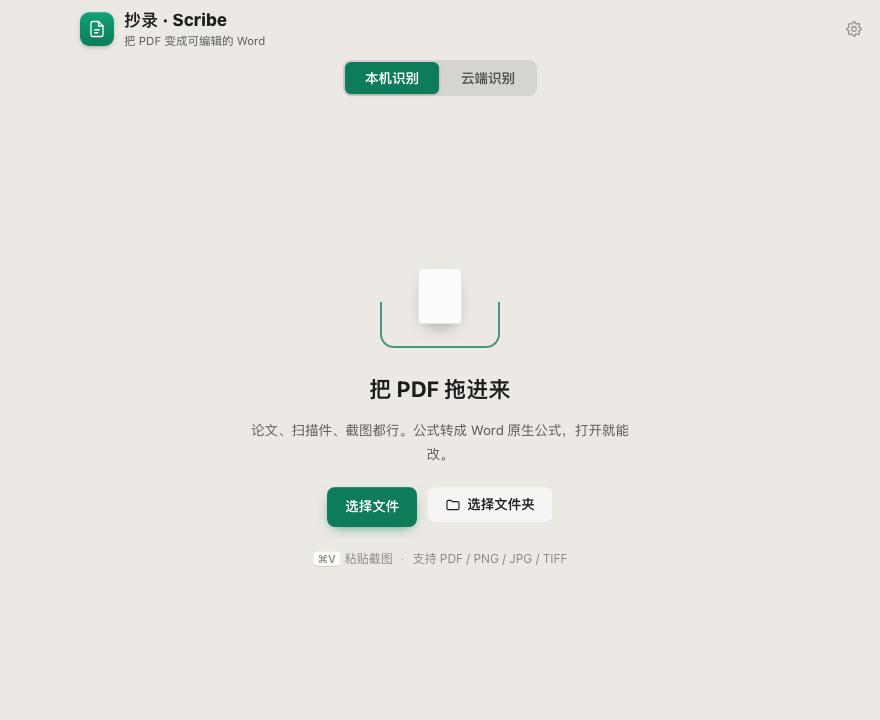
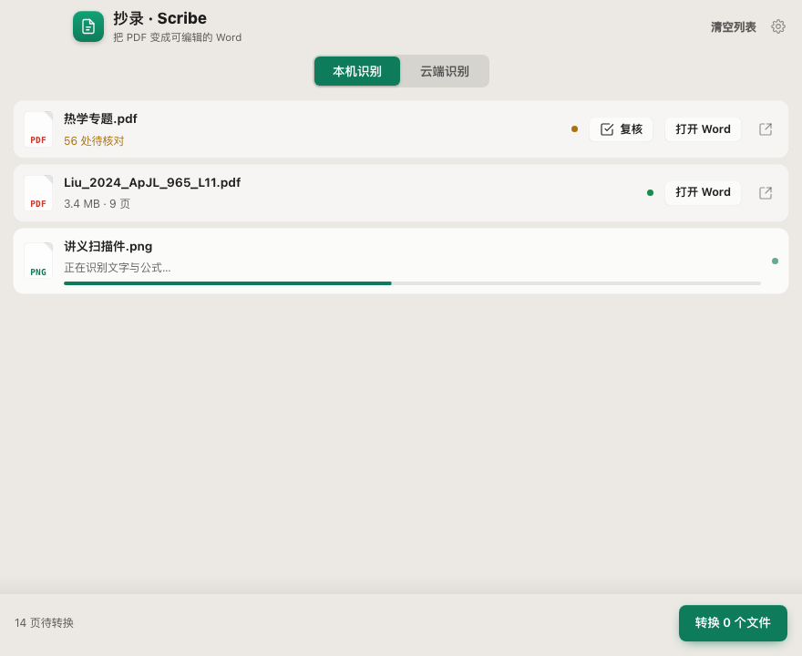

# 抄录 · Scribe

把 PDF 和图片转成**可编辑的 Word**——公式变成 Word 原生公式（OMML），不是图片，双击就能改。

> Turn scanned or digital PDFs into editable Word documents. Formulas become
> native Word equations (OMML), not images. macOS desktop app, Chinese/English UI.

<p align="center">
  
  
</p>

## 它解决什么问题

手里有一份扫描的讲义、教辅答案册或论文，想改其中几个字、几道题、几个公式。
常见的转换工具要么把公式变成图片（改不了），要么把中文排版拆得七零八落。

抄录做三件事：

- **公式转成 Word 原生公式**。转出来的 `.docx` 里，分式、上下标、根号都是可编辑的
  数学对象，不是截图。中文下标（如「c 水」）保持正体，不会被排成斜体变量。
- **版面尽量还原**。双栏阅读顺序、跨栏被切断的段落、表格行列、插图位置。
- **附一份复核报告**。识别不给置信度，所以每份转换旁边都有一份 HTML 报告，
  左边是原件截图、右边是识别结果，逐条对照着看一遍再用。

## 三条识别路径

同一份文件走哪条路由程序自动判断，用户不用选：

| 输入 | 路径 | 速度 |
|---|---|---|
| 数字排版、无公式 | 直接抽文字层 | 3 页通知 **0.2 秒** |
| 数字排版、有公式 | **混合路径**：纯文字行涂白，只让模型认公式 | 9 页论文 **337 秒**（整页识别 813 秒） |
| 扫描件 / 矢量公式 | 整页跑识别模型 | 约 20~90 秒/页 |

混合路径是这个项目里最有意思的一段：把公式一块块裁出来送模型是行不通的（每次调用有
12~14 秒固定开销，切得越碎越亏），反过来做才对——**调用次数不变，把纯文字行从页面上
涂白**，让模型只需要生成公式。实测全文 27% 的行含公式却只占 3% 的字符，输出 token
砍掉约 97%，而公式一条不少。

## 两种识别方式

<p align="center">
  
</p>

安装包**不含模型权重**，装完在设置里二选一：

- **本机识别**：点一下下载 2.2 GB 模型（默认走 ModelScope 源），之后文件不出这台电脑，
  没有额度限制。适合涉密材料或大批量。
- **云端识别**：填一个 [mineru.net](https://mineru.net/apiManage/token) 的 API Key，
  不用下模型、不占本地算力，实测比本机快一个数量级。代价是**文件会上传**，
  每天 1000 页额度，Key 有效期 90 天。超过 200 页的文件会自动分段上传，不用自己切。

界面上常驻一个二选一开关，因为「文件会不会离开这台电脑」不该藏在设置深处。

## 安装

到 [Releases](../../releases) 下载 `.dmg`（Apple Silicon），拖进「应用程序」。

未签名，首次打开会被 Gatekeeper 拦住——右键点图标选「打开」，或执行：

```bash
xattr -dr com.apple.quarantine /Applications/抄录.app
```

## 从源码运行

```bash
# 1. 识别引擎装在独立 venv（它自带一套 torch，跟主环境分开）
uv venv .venv-mineru && VIRTUAL_ENV=.venv-mineru uv pip install "mineru[core]"

# 2. 主环境依赖
pip install python-docx lxml beautifulsoup4 Pillow fastapi uvicorn pypdf pymupdf

# 3. pandoc（公式 LaTeX → OMML，必需）
brew install pandoc

# 4. 跑桌面应用（这个脚本处理了编译环境、端口清理、前端预编译）
./run-dev.sh
```

不需要 GUI 时用 CLI：

```bash
PYTHONPATH=src python3 -m p2w.cli 输入.pdf 文件夹/ -o 输出目录
PYTHONPATH=src python3 -m p2w.cli 论文.pdf --api-token <mineru.net key>   # 走云端
```

跑测试：

```bash
./tests/run_all.sh          # 全套，含一次真实转换
./tests/run_all.sh --fast   # 跳过真实转换
```

## 架构

三层，各自独立：

```
src/p2w/            核心转换库（纯 Python，与 GUI 无关）
  textlayer.py        文字层直通 + 三条路径的分流判据
  hybrid.py           混合路径：涂白 → 稀疏 PDF → 拼装
  mineru_backend.py   本地识别引擎（子进程调 MinerU CLI）
  mineru_cloud.py     云端 API（官方 v4 批量上传，超限自动分段）
  parse_mineru.py     content_list.json → DocModel
  render_docx.py      DocModel → .docx（公式经 pandoc 转 OMML）
  render_md.py        DocModel → .md（公式保留 LaTeX）

src/p2w_gui/        FastAPI 后端 + React 前端
src-tauri/          Tauri 外壳（Rust），启动时把后端作为子进程拉起
```

中间那层 `DocModel` 把解析和渲染解耦：Block（标题/段落/公式/图片/表格）+ Span
（段落内可混文字与行内公式），换识别引擎或换输出格式都不用动另一边。


## 已知限制

- **识别准确率取决于图源清晰度。** 这是辅助工具，复核环节是设计的一部分，不是可选项。
- **只在 Apple Silicon 上验证过。** Windows 构建已配置但未在真机验证。
- **未签名、未公证**，需要 Apple 开发者账号。
- 后端产生的错误提示目前只有中文，英文界面下仍显示中文。

## 依赖与许可

核心识别能力来自 [MinerU](https://github.com/opendatalab/MinerU)（OpenDataLab，**AGPL-3.0**）。
本项目通过子进程调用它；打包分发的安装包内含 MinerU，因此分发时需遵守 AGPL-3.0 的条款。

其它主要依赖：[PyMuPDF](https://github.com/pymupdf/PyMuPDF)（AGPL-3.0）、
[pandoc](https://pandoc.org)（GPL-2.0+）、[python-docx](https://github.com/python-openxml/python-docx)（MIT）、
[Tauri](https://tauri.app)（MIT/Apache-2.0）、[React](https://react.dev)（MIT）。
